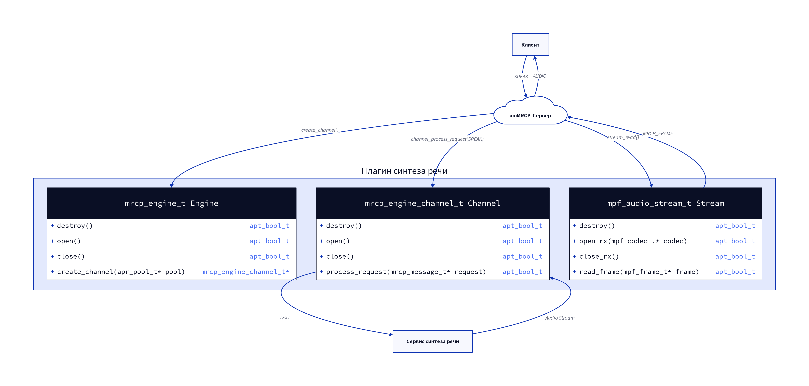
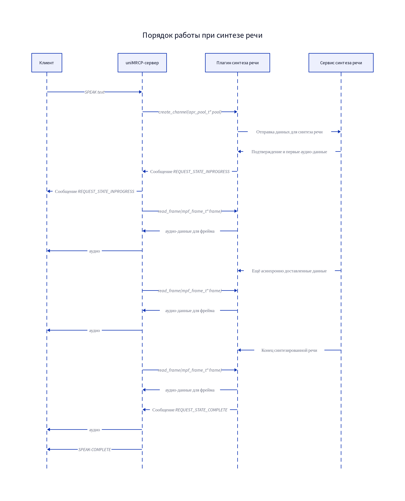

# Работа плагина синтеза речи, включённого в uniMRCP-сервер

## Основные компоненты плагина синтеза речи в составе uniMRCP-сервер


## Описание взаимодействия между MRCP-клиентом, uniMRCP-сервером и сервисом синтеза речи
Рассмотрим сценарий запроса клиентом синтеза речи. Клиент обращается к серверу, отправляя сообщение ```SPEAK``` с текстовыми данными для синтеза. В ответ сервер инициирует синтез речи и аудио-поток. Синтез речи на сервере осуществляет соответствующий плагин. Как и любой другой плагин, плагин синтеза речи можно представлять себе, состоящим из трёх модулей: Engine, Channel, Stream, как показано на схеме ниже.



После получения сообщения ```SPEAK``` сервер запрашивает открытие канала, вызывая функцию ```create_channel(pool)``` модуля Engine. Эта функция должна с помощью пула памяти ```pool``` создать объект типа ```mrcp_engine_channel_t``` и вернуть указатель на него. В поле ```.method_obj``` должен быть записан указатель на кастомный объект канала, который будет контролировать взаимодействие плагина с сервисом синтеза речи.

Имея в своём распоряжении канал, сервер перенаправляет сообщение клиента ему, вызывая функцию ```process_request(mrcp_message_t*)```. Эта функция осуществляет диспетчеризацию всех сообщений, которые сервер направляет плагину. Поэтому до возврата из этой функции серверу должно быть отправлено обязательное сообщение-ответ с результатом. Сама функция возвращает ```TRUE``` или ```FALSE```. Здесь мы рассмотрим только то, что должна сделать функция ```process_request(mrcp_message_t*)``` при получении сообщения ```SPEAK```. Она создаёт и направляет запрос к сервису синтеза речи, а также подготавливает кастомный объект канала к асинхронному получению аудио-потока от сервиса синтеза речи. В случае готовности принимать данные от сервиса синтеза речи и отправлять их клиенту функция должна установить поле ```.start_line.request_state``` в сообщении-ответе серверу равным ```MRCP_REQUEST_STATE_INPROGRESS```. Только в этом случае сервер подготовится к отправке потока аудио клиенту и начнёт вызывать функцию ```read_frame(mpf_frame_t*)```. Эти вызовы повторяются, пока сервер не получит сообщение об исчерпании аудио-потока.

Функция ```read_frame(mpf_frame_t*)``` получает указатель на объект-буфер ```mpf_frame_t```, в который она должна поместить следующую порцию аудио-данных. Для информации о канале, который контролирует получаемые от сервиса синтеза речи данные, объект ```mpf_audio_stream_t``` содержит в поле ```.obj``` указатель на кастомный объект канала. Отдельные фреймы будут обработаны сервером, собраны в аудио-поток и направлены в ответ клиенту. Когда в одном из выозовов функции ```read_frame(mpf_frame_t*)``` аудио-поток от сервиса синтеза речи будет исчерпан, необходимо отправить сообщение об этом серверу. *Порядок формирования такого сообщения следует рассмотреть отдельно.*

Диаграмма обмена данными при обработке запроса клиента ```SPEAK``` представлена ниже.


